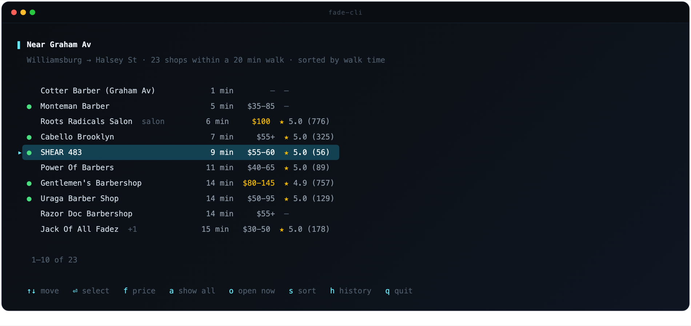
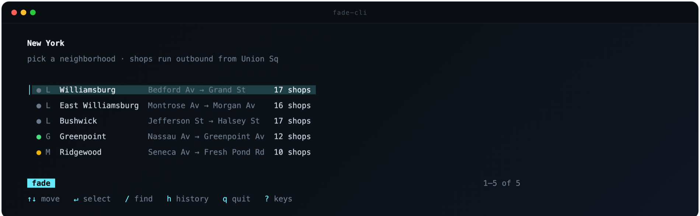
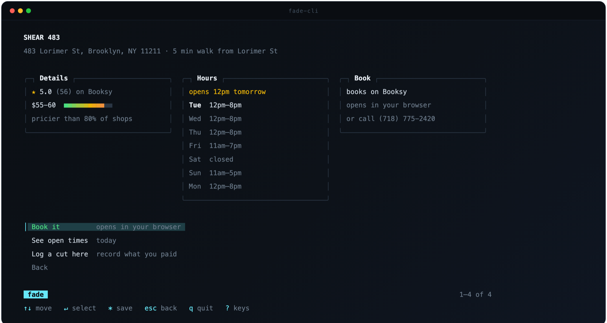

<div align="center">


<br>
<br>

[](go.mod)
[](LICENSE)
[]()
[]()

**Find your next haircut. Choose the service and time in your terminal.**

<br>



</div>

---

**fade** covers three subway corridors — the **L** from Bedford Av to Halsey St
(Williamsburg, East Williamsburg, Bushwick), the **G** through Greenpoint, and
the **M** through Ridgewood — 72 shops across Booksy, Fresha, Square, Squire,
Vagaro and plain phone lines. The catalog is compiled into the binary, so it
works offline and starts in single-digit milliseconds.

## Highlights

- **Walk times from real subway stops** — every shop is measured from the
  stop it belongs to, and `find --near graham` answers "what's within a
  20-minute walk of Graham Av"
- **Open now**, evaluated on the shop's clock (DST-correct), with hours
  sourced per shop — a shop nobody researched shows *unknown*, never a false
  "closed"
- **Direct booking links.** Directory pages that
  only say "call to book" are never presented as bookable — a test enforces it
- **Service, day, time, review** — browse Booksy and Fresha's live menus with
  prices and durations, choose a day, and select a time. Recheck availability
  before continuing to the shop's booking page
- **Live availability, no personal API keys** — integrations for Booksy and
  Fresha, covering 31 catalog entries. Provider changes or individual listings
  can affect coverage; failed checks are shown separately from full days
- **Manual connectors** for the thirty shops with no booking platform: a
  validated, prefilled call-or-text request, tracked until the shop answers
- **A cut log** that learns your real cadence (median, outlier-resistant)
  and tells you when you're due
- **A real TUI** — the city as an index, shops grouped by stop in the order
  the train reaches them, `/` to find, `?` for keys, `*` to save a shop,
  panels that reflow to the terminal, six color themes — and it degrades
  cleanly to flags and `--json` for scripts

## Install

```sh
git clone https://github.com/khayreali/fade-cli.git
cd fade-cli
make install       # builds and puts fade-cli on your PATH
```

Or just `make build` and run `./fade-cli` in place. One direct dependency,
`golang.org/x/term` for raw-mode key input (which pulls in `golang.org/x/sys`);
everything else is the standard library. The shop catalog is compiled into the
binary, so it works offline and starts in single-digit milliseconds.

Prebuilt binaries for macOS and Linux (Apple Silicon/ARM64 and Intel/AMD64)
are also available on the [releases page](https://github.com/khayreali/fade-cli/releases).
They do not require Go or a source checkout.

### Updates

Starting with **0.3.0**, the home screen checks for new stable releases in the
background and shows **Update available** when one is ready. Press **`u`**,
then choose **Install & restart**. You can keep browsing and update later.

```sh
fade-cli --version       # which version you are running
fade-cli update --check  # check now without installing
fade-cli update          # download and install the latest stable release
```

The updater chooses your platform, verifies the download's SHA-256 checksum,
and replaces the executable you launched. A failed download leaves the current
binary intact. Your settings, saved shops, history and local catalog are kept.
Startup checks are cached for one hour and do not delay browsing; explicit
checks always contact GitHub. Set `FADE_NO_UPDATE_CHECK=1` to disable background
checks. Offline startup works as usual.

**Already on 0.2.0 or earlier?** That binary does not contain an updater. From
your existing clone, run this once to get the update feature:

```sh
git pull --ff-only
make install
```

Future updates use the home-screen option or `fade-cli update`. Pushing source
commits does not notify users: a new version must be published as a release.

## Start here

Run it with no arguments:

```
$ fade-cli
```

There is nothing to set up. The first screen is the city as an index — the
five neighborhoods, each with its line, its first and last stop, and how many
shops it holds:



Pick one and you get its shops grouped by stop, in the order the train reaches
them from Manhattan — Bedford Av first on the L, Halsey St last; Nassau Av
before Greenpoint Av on the G; Seneca Av out to Fresh Pond Rd on the M. Within
a stop, shops sort by walk time from that stop. That is the screen at the top
of this page. Nothing about where you live is asked or remembered: the map is
the same for everyone, and a stop heading is how you find your part of it.

Arrow keys move (the cursor skips the headings), enter selects, `/` finds
(letters in order match, so `pwr` reaches Power Of Barbers; headings drop away
so the matches read as one list), and `?` lists every key on any screen.

`*` saves a shop. Saved shops are marked ◆ in place, and a **Saved** entry
appears at the top of the landing screen with all of them in one flat list.

Shops that take walk-ins say so, and when one is open the shop screen leads
with that rather than a phone number — for half the catalog "just turn up" is
the real answer, not "you can't book here".

Shops with known hours are marked ● open / ○ closed, and `o` narrows to what's
open right now. Hours are evaluated in New York time regardless of your
machine's clock. `f` caps the price; a cap keeps shops with no published price
and says so, because "unpriced" is not "over budget". If a filter empties the
list, it is relaxed with a note rather than showing nothing.

Columns with nothing in them are dropped, so a stop of call-only shops doesn't
render a column of dashes.

Selecting a shop gets you the detail screen: what the place is and how far
it is from its stop, the whole week's hours with today marked, how they book,
and a bar placing the price against every other shop in the catalog. The
panels sit side by side in a wide terminal and stack in a narrow one.



### Choose a service and time

At Booksy and Fresha shops, **Choose service & time** opens a guided flow.
`fade-cli book "Otis & Finn Williamsburg"` goes straight to the same screen:

1. Choose a service from the live menu, with its published price and duration.
2. Pick a date from the next two weeks. Times are grouped into morning,
   afternoon and evening; `d` changes the day and `r` refreshes availability.
3. Review the shop, service, price and time. Copy the details, or continue to
   the booking page after one more availability check.

All dates and times use New York time. `esc` goes back and cancels an in-flight
request; `ctrl-C` quits. A full day offers another date, and an unavailable
provider offers its booking page. Opening a page does not log a completed cut.

The booking page currently needs you to select the service and time again.
Your selected time is not held, and only the shop's confirmation completes
the appointment. **Copy booking details** keeps your choices handy.

### Controls

| Key | Does |
| --- | --- |
| `↑` `↓` or `k` `j` | move |
| `⏎` or `→` | select |
| `/` | find — type to narrow, enter keeps the filter, esc clears it |
| `*` | save or unsave the shop under the cursor |
| `u` | check for updates on the home screen |
| `?` | every key for the current screen |
| `esc`, `←`, or backspace | back (clears a filter first) |
| `1`–`9` | jump the cursor to that row (enter still confirms) |
| `g` `G` `home` `end` `pgup` `pgdn` | jump to ends, page |
| `ctrl-C` | quit, restoring your terminal |

Digits move the cursor rather than selecting outright, so typing `1` on the way
to `10` can't fire the wrong shop. While a search is open, letters go to the
search — `q` is a letter there, not quit.

### Themes

```sh
fade-cli themes                 # preview them in their own colors
fade-cli me --set-theme nord
```

Six built in: `fade` (the default, charcoal and teal), `nord`, `dracula`,
`gruvbox`, `paper`, and `mono`. A theme is a set of named roles — accent,
subtle, open, closed, overdue, selection, a low-to-high gradient for meters —
rendered at whatever depth the terminal has: truecolor, 256 colors, or the
basic sixteen. `NO_COLOR` is honored.

**Every theme adapts to your terminal's actual background.** On startup fade
asks the terminal what color its background is (the OSC 11 query most
terminals answer instantly; `COLORFGBG` is the fallback) and then pushes each
role just far enough from that color to stay readable — WCAG contrast
targets, per role: 4.5 for text and keys, 3 for secondary text, enough to
exist for borders. A theme on the dark ground it was designed for doesn't
move at all; the same theme on a blue, green or white terminal has its
faint grays lifted, its accent deepened or brightened, and its selection wash
rebuilt from the real ground, all keeping their hue. `fade-cli me` shows
which background it adapted to.

## Once you know what you want

The flag interface is still there, and it's faster when you know the shop:

```sh
fade-cli again                          # rebook wherever you went last
fade-cli find --under 45 --min-rating 4.9
fade-cli find --sort cheapest           # or: rated, nearest (default)
fade-cli find --to montrose --collapse  # one row per address
fade-cli slots --near graham --day fri  # sweep every shop in range at once
fade-cli slots shear-483 --services    # list the live menu, including IDs
fade-cli slots shear-483 --service 21896801 --day tomorrow
fade-cli book "power of barbers"
fade-cli book "Otis & Finn Williamsburg" --service Buzzcut
fade-cli book shear-483 --print        # link only; no interactive flow
fade-cli book eddo --at "fri 3pm"       # manual connector: prepared call/text
fade-cli appts                          # track those requests
fade-cli log add --shop cabello --price 55 --tip 10 --rating 5
fade-cli due                            # when you're next due
fade-cli log --stats                    # where you go, what you spend
fade-cli stops                          # the service area
```

## How booking works

Each shop has a route to arrange a visit. How depends on what the shop uses:

| Kind     | Live times      | How you book                     |
| -------- | --------------- | -------------------------------- |
| `booksy` | **yes**         | deep link to the shop's page     |
| `fresha` | **yes**         | deep link to the venue           |
| `square` | with a token    | deep link to the shop's page     |
| `link`   | no              | the shop's own site              |
| `vagaro` | no              | deep link to the venue           |
| `squire` | no              | deep link to the venue           |
| `phone`  | no              | the manual connector (below)     |

Fresha publishes two kinds of page. `/a/` is a partner venue with a booking
flow. `/lvp/` is a directory listing it generates for shops that are *not*
partners — it says so on the page and offers only "Call to book". Only `/a/`
counts as bookable, and a test enforces it. The directory pages are still
useful for hours and services, so they are kept on the shop as `info_url`,
which is never presented as a way to book.

### Live availability

`fade-cli slots` can read open times without an account, personal API key or
browser for the **31 catalog entries** on Booksy and Fresha. This is provider
coverage, not a guarantee that every listing answers on every run. Square,
Squire, Vagaro and custom websites have separate capabilities listed above.
A neighborhood sweep checks shops concurrently. This example is illustrative;
times and response speed vary:

```
$ fade-cli slots --near graham --within 0.5 --day tue

  Roots Radicals Salon  434 Graham Ave
    12:45pm  1:45pm  2:45pm

  SHEAR 483  483 Lorimer St
    10:00am  10:30am  11:00am  11:30am  12:00pm  12:30pm  2:00pm  3:00pm
    3:30pm   4:00pm   4:30pm   5:00pm   5:30pm   6:00pm   6:30pm   7:00pm

  Cabello Brooklyn  476 Humboldt Street
    no openings Tue
```

**How, when neither platform has a partner API:** their own websites do. A
marketplace shows a venue's open times to anyone before they log in, so the
page is a client of a public endpoint, and fade has the same conversation the
browser has — in plain `net/http`, nothing added to the dependency list.

- **Fresha** is a server-driven booking flow behind a GraphQL endpoint: each
  screen returns the action tokens for its buttons and the client echoes one
  back. fade opens a cart, adds the chosen service, picks "any professional",
  reaches the time screen and reads the day's slots. It does not select a
  timeslot or submit an appointment. The two mutations use persisted-query hashes,
  captured from Fresha's web bundle.
- **Booksy** fetches the business's service variants, then sends a `time_slots`
  query for the selected variant and day using the site's public client key.
  Changing dates reuses the loaded menu; final review refreshes it for price
  or duration changes.
- **Square** has a real, documented [Bookings API](https://developer.squareup.com/docs/bookings-api/what-it-does),
  but it is seller-scoped: set `FADE_SQUARE_TOKEN` once a shop has authorized
  you.

The hashes and the key are constants copied from the platforms' front ends, so
they will rotate when Fresha or Booksy ships a new build. Every failure
degrades to the handoff the CLI always had — "book it to see their calendar"
— and says which platform changed, so a broken integration never looks like an
empty calendar. Refreshing them is a capture away; `FADE_BOOKSY_API_KEY`
overrides the built-in key without a rebuild.

**Completing the booking currently happens on the provider's page.** fade
rechecks your selected time and opens the shop's booking URL. That URL does
not carry the chosen service or time, so both must be selected again. Provider
login, checkout and appointment creation have not been implemented.

The plain `slots` command selects a default haircut and labels it with the
service, price and duration returned by the provider. Use `--services` and
`--service <id>` for an explicit choice; duplicate service names require an ID.
A missing schedule or invalid time is an error, not an empty calendar.

### Manual connectors

Thirty shops have no booking platform at all. The manual connector takes
those as close to booked as software honestly can:

```sh
fade-cli book eddo --at "fri 3pm"
```

It validates the time against the shop's real hours — a request for a closed
Saturday is refused with the actual schedule — composes the request ("Hi! I'd
like to book a haircut at Eddo's Barber Shop on Friday Aug 14 around 3pm. My
name is …"), and offers the channels that make sense right now: call first
when they're open, a prefilled text first when they're closed, walking in when
that is the shop's whole model. The message lands on your clipboard either
way, and the request is tracked:

```sh
fade-cli appts               # requested and confirmed appointments
fade-cli appts confirm <id>  # when the shop says yes
fade-cli appts cancel <id>
```

A texted request is recorded as *requested*, not booked — the tool never
claims a chair the shop hasn't promised. `due` shows your next appointment,
and every time it renders is the shop's clock, not your laptop's.

Availability queries fan out concurrently across every shop and provider, so
the wait is bounded by groups of requests rather than a sequential shop list.

## Expanding to a new neighborhood

1. Add a `Corridor` to `Corridors` in `internal/geo/geo.go`. Stop ids are
   global, and no two stops may share a street corner — a shared corner splits
   one walkable cluster of shops across two service areas.
2. Append shops to `data/shops.json` with `address` and `booking`, leaving
   `point` out.
3. `fade-cli dev geocode` — fills coordinates from OpenStreetMap, rate-limited to
   OSM's 1 req/sec policy.
4. `fade-cli dev check` — reports what's still missing.
5. `fade-cli dev links` — checks every booking URL still resolves. Hosts that
   refuse scripted traffic are reported as blocked rather than dead, since that
   says nothing about whether a person can book there.
6. `fade-cli dev geocode --force --dry-run` — re-resolves every address and
   reports drift, flagging any shop whose stored point would move to a
   different stop, and any that only matched at street level. Takes about a
   second per shop (OSM's rate limit).

   Queens house numbers are hyphenated (`66-24 Forest Ave`) but OSM indexes
   some streets under the run-together form. Where the canonical address
   doesn't resolve, set `geocode_as` on the shop; the displayed address stays
   canonical.
7. Rebuild to embed the new data.

`fade-cli dev check` is the practical guide to what to research next. It also
warns when `data/shops.json` has been edited since the binary was built — the
catalog is embedded at compile time, so every other command would otherwise
read stale data without saying so.

## Known data gaps

- **Opening hours cover 56 of 72 shops.** `o` filters to open-now and browse
  marks each shop ●/○, but only where hours are on file. A shop nobody has
  researched shows no marker at all — never a false "closed". Hours are mined
  from each shop's own Booksy or Fresha page, whose structured data carries
  the full week; the 16 still blank publish no hours anywhere fetchable.
- **Prices cover 37 of 72, ratings 31.** Booksy and Fresha partner pages
  publish price ranges; directory listings and walk-in shops generally don't.
- **Walk-in policy is recorded for 11 shops only**, always from a source that
  states it. It is never inferred from a shop being a barbershop, because a
  wrong "just turn up" sends someone on a pointless walk.
- **Thirty shops still book by phone.** Each was individually checked
  against Booksy, Fresha, Squire and Vagaro; these publish nothing bookable.
  Two are walk-in only, where a phone number is the correct answer, not a
  fallback.
- **Two salons are included, marked as such.** Roots Radicals and Self Bushwick
  cut men's hair at \$100-120. Hiding them would withhold two of the
  best-rated options in the corridor; merging them silently into a list of
  \$25 fades would misrepresent what a row means. `--type salon` or
  `--type barbershop` filters either way.
- **Booksy models individual barbers as separate businesses.** Five barbers at
  681 Broadway are five catalog entries. `--collapse` folds them by address.
- **Two addresses in the original seed were invented** rather than sourced, and
  both survived every automated check because a confidently wrong value is
  internally consistent. Both are corrected; see Data sources.

## Development

```sh
make check           # fmt, vet, build, and the race-enabled tests
go test ./...        # unit tests only
make dist            # build four release binaries and SHA256SUMS
```

To ship an update, bump `version` in `cmd/fade-cli/main.go`, commit the change,
then push a matching version tag (for example `v0.3.1`). The release workflow
runs `make check`, verifies that the binary version matches the tag, and builds
the platform binaries. It uploads to a draft release and publishes only after
all assets are present. No personal API keys are needed for updates.

User state lives in `~/.config/fade/state.json`. Set `FADE_HOME` to relocate it.
Local shop corrections go in `~/.config/fade/shops.local.json` and override the
embedded seed by `id`, so you can fix a price without waiting on a release. An
entry **replaces** the seed shop outright rather than merging field by field —
copy across anything you want to keep, or the rating and hours go with it. Ids
not in the seed are added as new shops.

## Data sources

Shop data was compiled from public Booksy, Fresha and Vagaro listings plus shop
websites, and geocoded via OpenStreetMap Nominatim. Ratings and prices are
point-in-time snapshots — verify before relying on them.

Two addresses in the original seed were inferred rather than sourced, because a
search named a shop without giving its street. Both geocoded cleanly to
plausible Brooklyn locations near the right stop, so every automated check
passed them — coordinates resolved, precision was exact, drift was zero. A
confidently wrong value is invisible to consistency checks, since it is
internally consistent. Both were caught only by comparing against an outside
source, and both are corrected.

Every rating carries a `rating_src` (`booksy`, `fresha`, `google`, `web`) and
the shop screen shows it. Booksy, Fresha and Google score different populations
on different scales, so a bare number invites a comparison it can't support.
Ratings without a findable review count are stored without one rather than
being given a plausible-looking figure.
